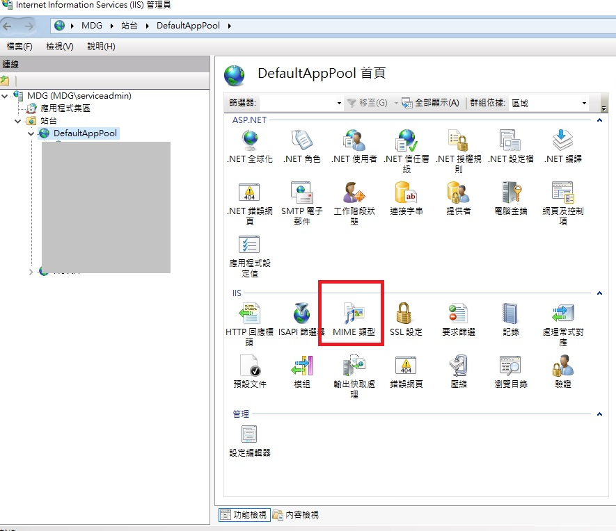
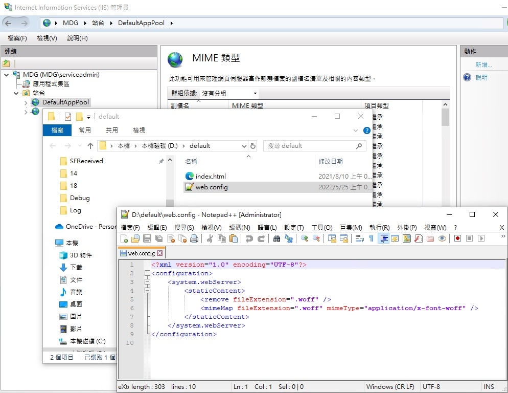
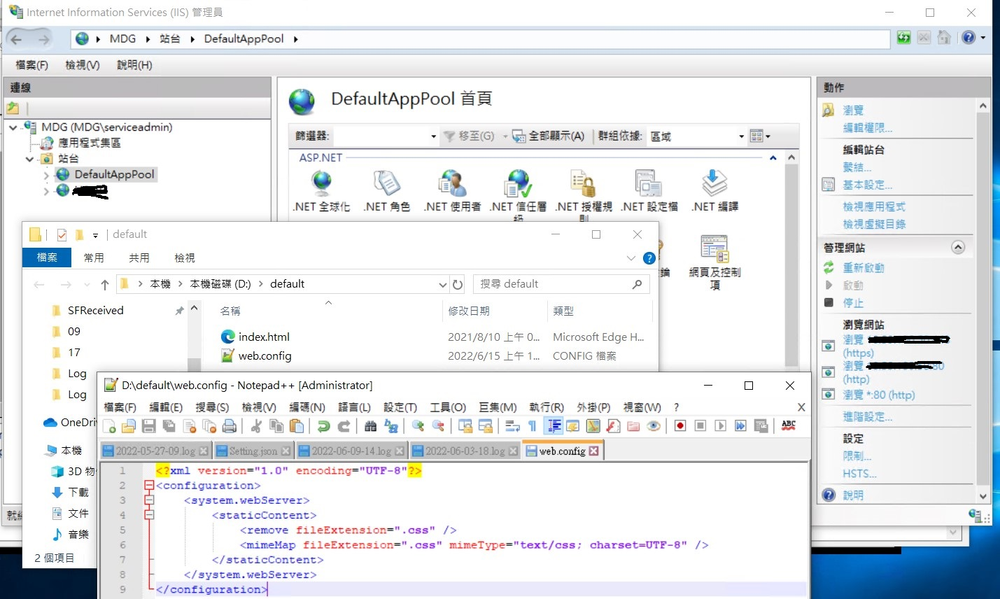

## font awesome 刷新頁面圖示偶爾出現亂碼

### 使用到環境
1. IIS版本 V10
2. 前端Vue2
3. Server Windows 10

### 觀察:伺服器重啟剛開啟頁面的幾次??
### 目前嘗試辦法  
1. index.html 新增 < meta charset="utf-8" > => 還是會偶爾出現...

2. IIS增加woff等字型格式的MIME  => 還是會偶爾出現...

    + 修改 .woff 與 .woff2 MIME type   
    (參考:https://www.itread01.com/article/1481468594.html )    

    1.使用IIS GUI 點選MIME修改設定   
       
    2.或是直接修改根目錄的web.config設定檔案(注意IIS7之後好像才支援?)     
    (PS.不知道可不可以直接修改專案下面的web.config檔案????)  
      

    > IIS 預設:
    ```
    fileExtension=".woff" mimeType="font/x-woff"  
    fileExtension=".woff2" mimeType="application/font-woff2"  
    ```
    >修改:
    ```
    fileExtension=".woff" mimeType="application/font-woff"   
    ```

3. 修改 .woff 類型 => 還是會偶爾出現...
    ```
    fileExtension=".woff" mimeType="application/x-font-woff"    
    fileExtension=".woff2" mimeType="application/x-font-woff"    
    ```
4. 修改 .woff 類型 => 還是會偶爾出現...
    ```
    fileExtension=".woff" mimeType="application/x-font-woff"    
    fileExtension=".woff2" mimeType="application/font-woff"    
    ```
5. 修改 .woff 類型 => testing...
    ```
    fileExtension=".woff" mimeType="application/font-woff"    
    fileExtension=".woff2" mimeType="application/font-woff2"    
    ```
    > 所有.scss檔案都新增  @charset "UTF-8";   

    > IIS 中(web.config)設定 .css 檔案 response 中 content-type 要回應 charset=UTF-8   
      


* 使用 css-unicode-loader   => 尚未嘗試   
    + 參考 : https://github.com/styzhang/css-unicode-loader

<br>

### MIME type 介紹
+ https://topic.alibabacloud.com/tc/a/network-what-is-mime-type_1_38_30917192.html

+ 瀏覽器通過 MIME TYE,也就是該資源的媒體類型，來決定以什麼形式顯示資料。 Web 服務器要求標頭中的 Content-Type 來告知瀏覽器資料類型 EX : Content-Type: text/HTML
+ 只有一些在互連網上獲得廣泛應用的格式才會獲得一個 MIME Type，如果是某個用戶端自己定義的格式，一般只能以 application/x-開頭

<br>

### 一樣問題文章
+ 參考 : https://segmentfault.com/q/1010000022644277 
+ 參考 : https://segmentfault.com/q/1010000012647369?utm_source=sf-similar-question
